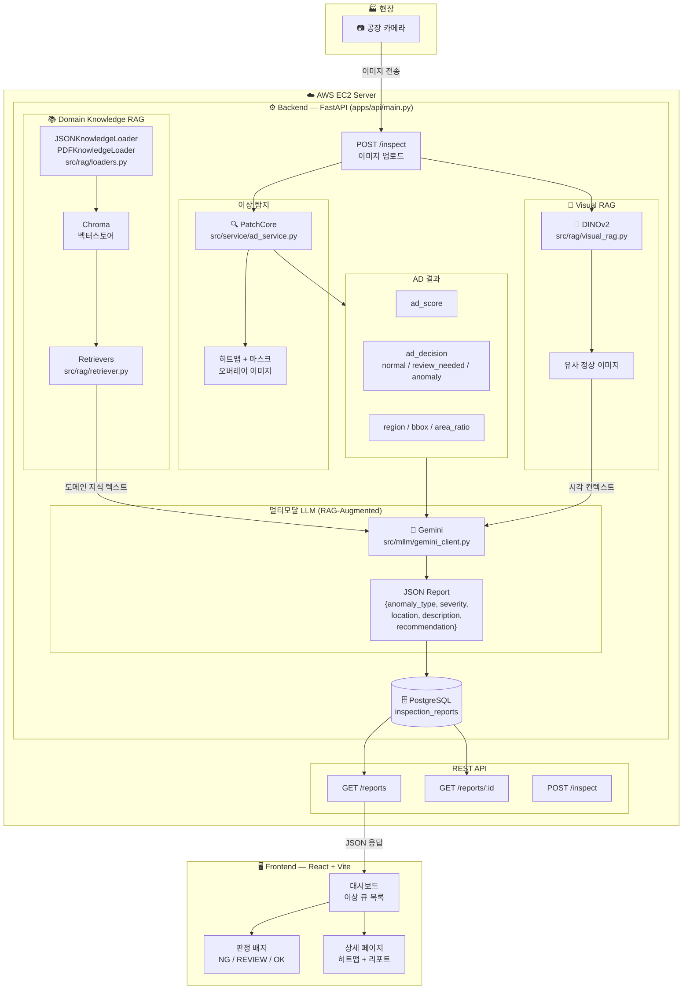
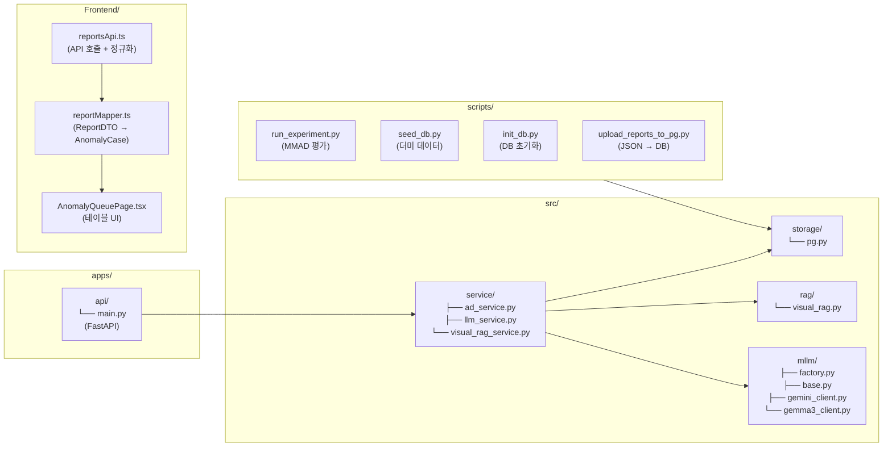
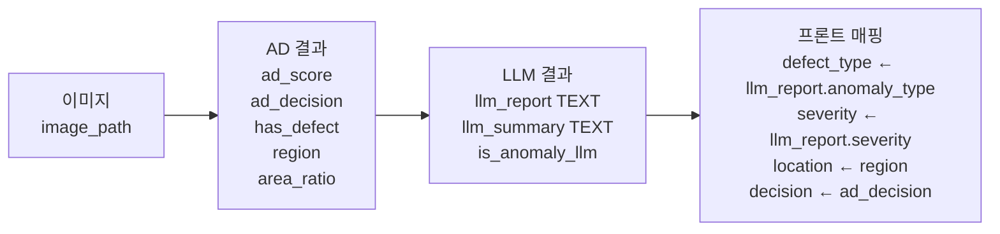

# MMAD Inspector — 시스템 아키텍처

## 전체 파이프라인

```mermaid
flowchart TB
    subgraph FIELD["🏭 현장"]
        CAM[📷 공장 카메라]
    end

    subgraph EC2["☁️ AWS EC2 Server"]
        subgraph BACKEND["⚙️ Backend — FastAPI (apps/api/main.py)"]
            direction TB
            UP[POST /inspect\n이미지 업로드]

            subgraph AD["이상 탐지"]
                PC[🔍 PatchCore\nsrc/service/ad_service.py]
                HM[히트맵 + 마스크\n오버레이 이미지]
            end

            subgraph ADINFO["AD 결과"]
                SC[ad_score]
                DC[ad_decision\nnormal / review_needed / anomaly]
                RG[region / bbox / area_ratio]
            end

            subgraph VRAG["📸 Visual RAG"]
                DV[🧠 DINOv2\nsrc/rag/visual_rag.py]
                NI[유사 정상 이미지]
                DV --> NI
            end

            subgraph KRAG["📚 Domain Knowledge RAG"]
                KL["JSONKnowledgeLoader\nPDFKnowledgeLoader\nsrc/rag/loaders.py"]
                CH[Chroma\n벡터스토어]
                RT["Retrievers\nsrc/rag/retriever.py"]
                KL --> CH --> RT
            end

            subgraph LLM["멀티모달 LLM (RAG-Augmented)"]
                GM[🤖 Gemini\nsrc/mllm/gemini_client.py]
                RP["JSON Report\n{anomaly_type, severity,\nlocation, description,\nrecommendation}"]
                GM --> RP
            end

            DB[(🗄️ PostgreSQL\ninspection_reports)]

            UP --> PC
            PC --> HM
            PC --> ADINFO
            UP --> DV
            ADINFO --> GM
            NI -->|시각 컨텍스트| GM
            RT -->|도메인 지식 텍스트| GM
            RP --> DB
        end

        subgraph API["REST API"]
            R1[GET /reports]
            R2[GET /reports/:id]
            R3[POST /inspect]
        end

        DB --> R1
        DB --> R2
    end

    subgraph FRONT["🖥️ Frontend — React + Vite"]
        direction LR
        DH[대시보드\n이상 큐 목록]
        DT[판정 배지\nNG / REVIEW / OK]
        DD[상세 페이지\n히트맵 + 리포트]
    end

    CAM -->|이미지 전송| UP
    R1 -->|JSON 응답| DH
    DH --> DT
    DH --> DD
```

---

## 코드 구조

```mermaid
flowchart LR
    subgraph SRC["src/"]
        direction TB
        ML["mllm/\n├── factory.py\n├── base.py\n├── gemini_client.py\n└── gemma3_client.py"]
        SV["service/\n├── ad_service.py\n├── llm_service.py\n└── visual_rag_service.py"]
        ST["storage/\n└── pg.py"]
        RG["rag/\n└── visual_rag.py"]
    end

    subgraph APPS["apps/"]
        AP["api/\n└── main.py\n(FastAPI)"]
    end

    subgraph SCRIPTS["scripts/"]
        direction TB
        EX["run_experiment.py\n(MMAD 평가)"]
        SD["seed_db.py\n(더미 데이터)"]
        ID["init_db.py\n(DB 초기화)"]
        UP["upload_reports_to_pg.py\n(JSON → DB)"]
    end

    subgraph FRONT["Frontend/"]
        RA["reportsApi.ts\n(API 호출 + 정규화)"]
        RM["reportMapper.ts\n(ReportDTO → AnomalyCase)"]
        PG["AnomalyQueuePage.tsx\n(테이블 UI)"]
    end

    AP --> SV
    SV --> ML
    SV --> RG
    SV --> ST
    SCRIPTS --> ST
    RA --> RM --> PG
```

---

## 데이터 흐름 (DB 컬럼)

```mermaid
flowchart LR
    A["이미지\nimage_path"] --> B["AD 결과\nad_score\nad_decision\nhas_defect\nregion\narea_ratio"]
    B --> C["LLM 결과\nllm_report TEXT\nllm_summary TEXT\nis_anomaly_llm"]
    C --> D["프론트 매핑\ndefect_type ← llm_report.anomaly_type\nseverity ← llm_report.severity\nlocation ← region\ndecision ← ad_decision"]
```
